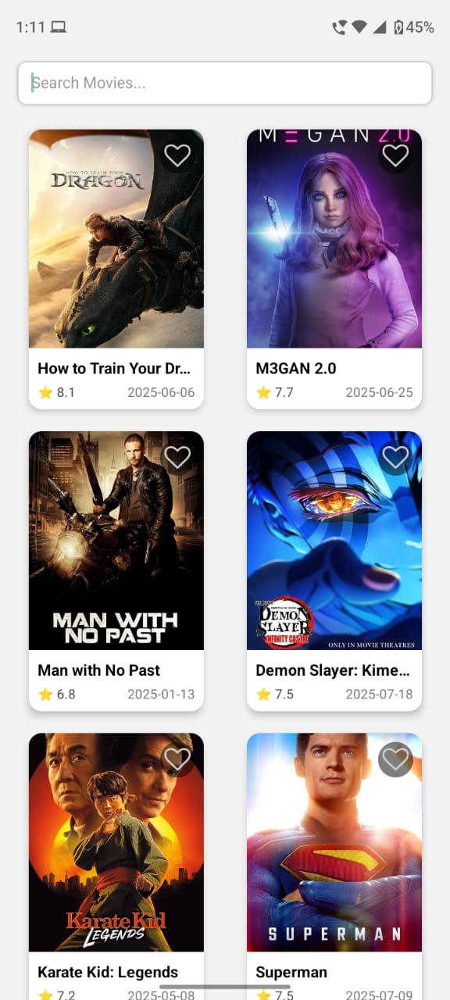

# 🎬 Movie Explorer App

A simple, elegant React Native app that lets users explore popular movies, view details, and add them to favorites. Built with modern React Native patterns, Redux Toolkit, and TypeScript — without using Expo.

---

## 📱 App Preview

 

## 🚀 Features

- Search movies
- Mark favorites
- Persistent storage using Redux Persist

---

## ✨ Features

- 📃 **Home Screen**: Displays a list of popular movies using mock/static data
- 🔍 **Search Functionality**: Filter movies by title in real time using Redux state
- 🎥 **Movie Details Screen**: View detailed info with option to mark as favorite
- ❤️ **Favorites**: Add/remove movies from favorites using Redux
- 🚀 **TypeScript**: Fully written in TypeScript with modular structure
- 📱 **Navigation**: Seamless navigation using React Navigation

---

### Clone the repo

```bash
git clone https://github.com/rahulprasad5080/Movie-Explorer.git
cd movie-explorer

```

```bash
Install dependencies
npm install
```

```bash
Run on Android
npx react-native run-android
```

🙏 Thank You!

I appreciate the opportunity to work on this assignment. Looking forward to your feedback!
